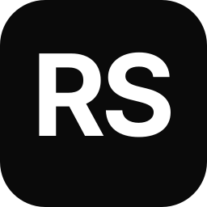

<div align="center">



# Rizwan Syed — Technical Portfolio

### IT Security Administrator • Cybersecurity • Networks • Infrastructure • Automation • Cloud

[](https://nextjs.org/)
[](https://react.dev/)
[](https://www.typescriptlang.org/)
[](https://tailwindcss.com/)

[](https://linkedin.com/in/rizwan-syed-79b798211)
[](https://www.credly.com/users/rizwan-syed.6b6ea3c9)
[](mailto:syedsrizwansr@gmail.com)

</div>

---

## About

IT Security Administrator with **4+ years** of enterprise IT experience across cybersecurity, networks, servers, virtualization, and databases, supporting environments ranging from **800 to 1,700+ users** while maintaining **99.9% uptime**.

What sets me apart: **I don't just operate infrastructure—I build tools to improve it.** From centralized network management and monitoring to certificate lifecycle automation and SQL-backed RBAC platforms, I turn complex manual processes into secure, scalable, and reliable systems.

**Currently:** IT Security Administrator at Koike Aronson, Inc.
**Based in:** New York, USA

---

## Core Stack

| Domain | Technologies |
|--------|--------------|
| **Systems** | Windows Server 2016/2019/2022 • Linux (RHEL / Ubuntu / CentOS) • Active Directory • Group Policy • DNS • DHCP |
| **Virtualization** | VMware vSphere (HA/DRS, 100+ VMs) • Hyper-V • SAN/NAS • NFS • SMB/CIFS |
| **Cloud / Identity** | Microsoft Entra ID • Microsoft 365 • Intune • Exchange Online • Azure • AWS |
| **Networking** | Palo Alto • Dell SONiC • VLANs • Switching • Routing • NAT • VPN • SNMP • Syslog |
| **Security** | CISSP • SentinelOne • ManageEngine Log360 • ADAudit Plus • PKI / Certificates • RBAC • MFA |
| **Databases** | Microsoft SQL Server (admin, backup, T-SQL, performance) |
| **Backup / DR** | Veeam Backup & Replication • DR planning • failover testing |
| **Automation** | PowerShell (advanced) • Python • Bash • FastAPI |
| **Monitoring** | ManageEngine EventLog Analyzer • SolarWinds • Nagios • Zabbix • SNMP/Syslog |

---

## Certifications

- **Certified Information Systems Security Professional (CISSP)** — ISC2 (Jul 2026 – Jul 2029)
- **AWS Certified Solutions Architect – Associate** — AWS (Feb 2025 – Feb 2028)
- **Microsoft Certified: Windows Server Hybrid Administrator** — Microsoft
- **Microsoft Azure Fundamentals (AZ-900)** — Microsoft
- **Red Hat Certified Engineer (RHCE)** — Red Hat
- **Certified Angular Developer** — Credo Systemz
- **Internet of Things** — Smartinternz (Credential ID: SB2020000080942)

---

## Publication

**"Face Mask Detection with Alarm using Machine Learning"** — International Research Journal of Modernization in Engineering, Technology and Science (IRJMETS), Volume 05, Issue 03, March 2023 (Impact Factor 7.868).
DOI: [10.56726/IRJMETS34706](https://www.doi.org/10.56726/IRJMETS34706)

---

## About this Repository

This is my personal portfolio site — a Next.js 16 / React 19 / TypeScript / Tailwind CSS application. All portfolio content (personal info, experience, projects, skills, achievements) is driven from a single typed data file at `src/data/portfolio.ts`, with types in `src/types/index.ts`.

### Local Development

Prerequisites: Node.js 18+.

   ```bash
   npm install
npm run dev
```

The site will be available at [http://localhost:3000](http://localhost:3000).

### Optional Environment Variables

Create `.env.local` at the repository root if you want the built-in chat assistant to work:

```env
# AI chat assistant (either provider works; both configured = automatic failover)
GROQ_API_KEY=your_groq_key
GEMINI_API_KEY=your_gemini_key
```

The contact form uses FormSubmit and requires no password. Its destination address must approve FormSubmit's one-time activation email before messages can be delivered.

Without the AI keys the site still renders — only the chat assistant will show an error message.

### Production Build

```bash
npm run build
npm start
```

---

## License

MIT

<div align="center">
  <p>Engineered by <a href="https://linkedin.com/in/rizwan-syed-79b798211">Rizwan Syed</a></p>
</div>
